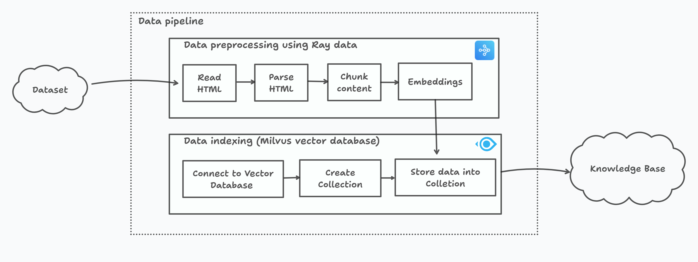

# Datapipeline

The graphic below illustrates different components of the datapipeline.



First, step involves downloading the dataset. The dataset this project consists of [Triton documentation](https://docs.nvidia.com/deeplearning/triton-inference-server/user-guide/docs/contents.html#).

Datapipeline consists of two components:

1. Data Preprocessing
2. Data Indexing

The following sections examine each of these in detail.

## Data preprocessing

Data preprocessing takes in raw HTML contents, converts it into chunked text, and, calculates embedding for these chunks to make it ingestible in format suitable for vector database.

The steps involved in data preprocessing are

- Read and parse HTML content to extract text.
- Chunk the text using `RecursiveCharacterTextSplitter` function from langchain text splitter library. Chunk helps control the length of text passed as context to LLM.
- Get embeddings for the chunked text. There are 3 types of embedding models supported:
  - Dense Embedding
  - Sparse Emebedding
  - Full-text embedding using BM-25 model

> [!TIP]
> The `build_data_pipeline` function in [data_pipeline.py](../agentic_rag/data_pipeline/data_pipeline.py) implements all the above mentioned steps in data preprocessing.

## Data Indexing

Data indexing uses the output from data preprocessing i.e. chunk text, chunk metadata, embeddings and stores these into a vector database. This will be the knowledge base used to provide context for the user input queries.

The steps involved in data indexing are

- Connect to vector database store
- Create a colletion inside vector database
- Store the chunk text, chunk metadata, embeddings inside the collection

> [!TIP]
> The `build_index` function in [indexing.py](../agentic_rag/data_pipeline/indexing.py) implements all the above mentioned steps in data indexing.

## Technical Details

### Ray Data

[Ray Data](https://docs.ray.io/en/latest/data/data.html) does most of the heavy-lifting and is super fast. It speeds up the data preprocessing and provides configuration to scale this logic out of the box.

**Reading Data**

- `from_items`: Ray data provides a [lot of options](https://docs.ray.io/en/latest/data/loading-data.html#reading-files) to read data files to create a [Ray Dataset](https://docs.ray.io/en/latest/data/api/dataset.html#ray.data.Dataset). In this case, [from_items](https://docs.ray.io/en/latest/data/api/doc/ray.data.from_items.html#ray.data.from_items) creates a Dataset from list of Python objects. This approach is works well for small dataset.

**Transformations**

- `flat_map`: [flat_map](https://docs.ray.io/en/latest/data/api/doc/ray.data.Dataset.flat_map.html#ray.data.Dataset.flat_map) provides a way to iterate and transform the Dataset. In this case, `flat_map` reads the HTML files, parses and extract the text content. `BeautifulSoup` library is used to parse HTML content.

- `map_batches`: [map_batches](https://docs.ray.io/en/latest/data/api/doc/ray.data.Dataset.map_batches.html#ray.data.Dataset.map_batches) provides a different approach to transform the Dataset. This approach is useful for vectorized operation to be performed in batches. Ray Data uses Actors to execute the [embedding](../agentic_rag/data_preprocess/embed.py) classes.

> [!NOTE]
> Transformations are lazy by default. They aren’t executed until you trigger consumption of the data

**Computation**

- `Fractional GPU`: As part of `map_batches`, `num_gpus` parameter allows fractional values. In this case, value of `0.5` allows shared use of 1 GPU between Dense Embedding and Sparse Embedding models.

- `Concurrency`: As part of `map_batches`, `concurrency` parameter allows creating multiple concurrent workers that perform transformation of data in parallel. In this case, value of `1` is set for both Dense Embedding and Sparse Embedding models as setting a value > 1 will require multiple gpus. Value of `4` is set for BM-25 model as it is ran on CPU and we can distribute the computation across multiple CPU cores.

### Milvus

[Milvus](https://milvus.io/docs) vector store is used as vector database. There is no particular rationale for using this db over many other options out there. More specifically, it was chosen as it provides utility embedding functions for all approaches experimented in this project.

> [!IMPORTANT]
> Any vector database can be used as drop-in replacement for Milvus here as long as both Dense and Sparse indexing is supported by the database.

### Embeddings

There is support for 3 embedding approaches: Dense, Sparse and Full-text.

- Dense embedding: This class uses [SentenceTransformer](https://www.sbert.net/) library to use any embedding model as part of the library.

- Sparse embedding: This class uses [BGEM3EmbeddingFunction](https://milvus.io/docs/embed-with-bgm-m3.md) embedding function part of [milvus-model](https://github.com/milvus-io/milvus-model) library as sparse embedding model. Support for using other sparse models is limited.

- Full-text embedding: This class uses [BM25EmbeddingFunction](https://milvus.io/docs/embed-with-bm25.md) embedding function part of [milvus-model](https://github.com/milvus-io/milvus-model) library as full-text embedding model. BM25 can generate sparse embeddings by representing documents as vectors of term importance scores, allowing for efficient retrieval and ranking in sparse vector spaces.

> [!TIP]
> [embed.py](../agentic_rag/data_preprocess/embed.py) implements all the embedding approaches that contain functions to embed the dataset and input query.

## Configuration

The [config.py](../agentic_rag/configs/config.py) provides different knobs that can be configured as part of this project. Listed below are the configuration relevant to data pipeline.

```python
ROOT_DIR = Path(__file__).parent.parent.parent.absolute()
DATA_DIR = ROOT_DIR / "dataset"

BATCH_SIZE = 128
CHUNK_SIZE = 500
CHUNK_OVERLAP = 50
EMBEDDING_MODEL_NAME = "all-MiniLM-L6-v2"
EMBEDDING_MODEL_DIM = 384
DENSE_METRIC = "COSINE"
SPARSE_METRIC = "IP"
ENABLE_SPARSE_INDEX = False
ENABLE_FULL_TEXT_INDEX = True
COLLECTION_NAME = "nvidiatritondocs"
```

- `DATA_DIR`: Path to where dataset is downloaded.
- `BATCH_SIZE`: Batch size used by Ray Data when running embedding models
- `CHUNK_SIZE` and `CHUNK_OVERLAP`: Parameters of `RecursiveCharacterTextSplitter` function used to control how the size and overlap of chunked text.
- `EMBEDDING_MODEL_NAME`: Name of the embedding model from [SentenceTransformer](https://www.sbert.net/) library. Any other embedding model should just work fine.
- `EMBEDDING_MODEL_DIM`: The output dimension of the embedding model used. This value is used by Milvus vector database while creating a collection.
- `DENSE_METRIC` and `SPARSE_METRIC`: These metrics are used while creating a index by Milvus vector store. Sparse index only supports `IP` distance metric.
- `ENABLE_SPARSE_INDEX` and `ENABLE_FULL_TEXT_INDEX`: Whether to enable sparse or full-text indexing.
- `COLLECTION_NAME`: Name of the collection created inside Milvus vector store.
