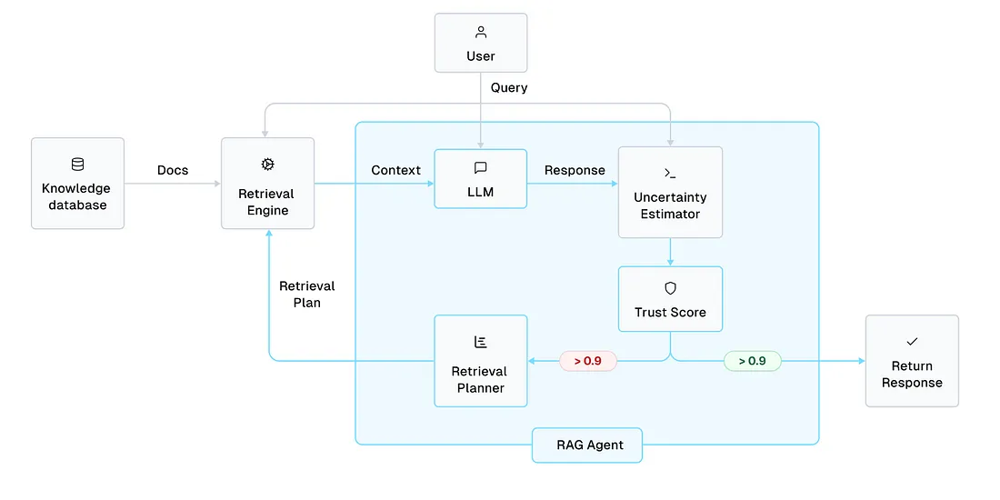

# Query pipeline

The graphic below illustrates different components of the query pipeline.

<figure>

<figcaption style="text-align:center"> Image Credits: <a href="https://pub.towardsai.net/reliable-agentic-rag-with-llm-trustworthiness-estimates-c488fb1bd116">Chris Mauck </a></figcaption>
</figure>

Once knowledge base is built using [data pipelines](./Datapipeline.md), user can send a query to get response from LLM using context retrieved from knowledge base.

Query pipeline consists of 4 diffferent components

1. Retrieval Planner
2. LLM Engine
3. Unceratininty Estimator
4. Retrieval Engine

The following sections examine each of these in detail.

## Retrieval Planner

There are 5 retrieval strategies that retrieval planner can use to get relevant context to answer the query. These strategies have increased complexity, time and cost from No Retrieval being the simplest to HyDE Retrieval to the costliest.

- No Retrieval

    No context is retrieved.

- Semantic Search

    Vector database is used to fetch similar documents to the input query in the embedding space.

- Hybird Search (Semantic + Keyword Search or Sparse) with Reciprocal Rank Fusion

    There are 3 options for Hybrid Search : Semantic + Sparse (`ENABLE_SPARSE_INDEX`), Semantic + Keyword Search (`ENABLE_FULL_TEXT_INDEX`) or Semantic + Sparse + Keyword Search (Both set to `True`) controlled by two parameters in the [config.py](../agentic_rag/configs/config.py), depending on which parameter is set to `True` or `False`. The embedding models used for these approaches are detailed in the [embedding](./Datapipeline.md#embeddings) section of data pipeline documentation.

    The results from these search retrieval approaches are passed to Reciprocal Rank Fusion (RRF) algorithm to further rank the documents.

- Hybird Search (Semantic + Keyword Search or Sparse) with Reranker model

    There are 3 options for Hybrid Search : Semantic + Sparse (`ENABLE_SPARSE_INDEX`), Semantic + Keyword Search (`ENABLE_FULL_TEXT_INDEX`) or Semantic + Sparse + Keyword Search (Both set to `True`) controlled by two parameters in the [config.py](../agentic_rag/configs/config.py), depending on which parameter is set to `True` or `False`. The embedding models used for these approaches are detailed in the [embedding](./Datapipeline.md#embeddings) section of data pipeline documentation.

    The results from these search retrieval approaches are passed to Reranker model to further rank the documents.

- HyDE Retrieval

    Hypothetical Document Embeddings (Hyde) is one of the query expansion approach that uses an LLM to generate hypothetical document that are relevant to query but fake. These documents are used as input to the retriever where embedding model finds documents near to these fake documents in the embedding space.

> [!TIP]
> The `RetrievalPlanner` class in [retrieval_agent_planner.py](../agentic_rag/retrieval/retrieval_agent_planner.py) implements all the retrieval strategies.

## LLM Engine

LLM Engine provides a way to get response from any LLM supported by [litellm](https://docs.litellm.ai/docs/providers) library. It allows for ease of switching to any LLM provider with 1-2 lines of code change.

> [!TIP]
> The `LLMEngine` class is implemented in [llm_engine.py](../agentic_rag/generation/llm_engine.py).<br>
> [LLM]() configuration section shows how to change and configure various LLMs

## Uncertainity Estimator

Uncertainity estimator is the crux of our RAG pipeline. It quantifies how releveant and reliable the LLM response is to the input query. RAG applications suffer from significant shortcoming of producing hallucinations i.e. made up elements in their response. There exists uncertainitiy quantification techniques such as [BSDetector](https://arxiv.org/pdf/2308.16175) and [SelfCheckGPT](https://arxiv.org/pdf/2303.08896).

The approaches for these techniques can be classified under grey-box methods or black-box methods. Grey-box methods have access to token-level probability in the LLMs response which can be used to generate an uncertainity score. SelfCheckGPT paper provides several approaches such as BERTScore, Question Answering, n-grams, NLI and Prompt to provide a inconsistency/hallucination score among various LLM sampled responses for same input query. BSDetector paper builds on SelfCheckGPT approach providing confident assessment based on two factors, observed consistency and self-reflection certainity. Similar to SelfCheckGPT paper, observed consistency measures uncertainity score amongst possible multiple LLM responses for same input query. Self-reflection certainity score is an estimate by LLM itself when asked to score how confident it is that original answer was correct. Overall confidence score is a combination of observed consistency and self-reflection certainity scores.

> [!TIP]
> The function `calculate_uncertainity` provides trustworthy score for a LLM response and LLM prompt in `RetrievalEngine` class [retrieval_engine.py](../agentic_rag/retrieval/retrieval_engine.py).

## Retrieval Engine

Retrieval Engine brings all of the components LLM engine, retrieval planner and uncertainity estimator above together. For a given user input query,

1. Retrieval engine sends the input query to retrieval planner.
2. Retrieval planner using the selected retrieval strategy fetches a context from knowledge base (or returns empty string for No Retrieval strategy).
3. LLM engine takes input the fetched context and input query to construct a LLM prompt. This prompt is sent to an LLM to get a response.
4. Both the LLM response and prompt are sent to another LLM that provides a trustworthy score of how reliable the LLM response is for the given prompt.
5. If trustworthy score > `TRUST_SCORE_THRESH` , return the LLM response back to the user.
6. Else repeat all the steps above until all the retrieval strategies `RETRIEVAL_PRIORITY` list is exhausted in the [config.py](../agentic_rag/configs/config.py).
7. Finally, if there are not any retrieval strategy that passes the trustworthy threshold, return a boilerplate response `STUB_RESPONSE` in the [config.py](../agentic_rag/configs/config.py)

> [!TIP]
> The `RetrievalEngine` class is implemented in [retrieval_engine.py](../agentic_rag/retrieval/retrieval_engine.py).

## Technical Details

### Retrieval strategies

There are 5 retrieval strategies implemented as part of this RAG pipeline. The priority is decided by human specifically, `RETRIEVAL_PRIORITY` parameter in the [config.py](../agentic_rag/configs/config.py).

```python
RETRIEVAL_PRIORITY = [
    "no_retrieval",
    "semantic_search",
    "hybrid_search_with_rrf",
    "hybrid_search_with_reranker",
    "hyde_retrieval",
]
```

These retrieval priority is decided from simplest and no-cost approach (`no_retrieval`) to increasing complexity and cost approach.

> [!IMPORTANT]
> Can we offload this task of manually creating a retrieval priority list to an LLM Agent? <br>
> The current RAG setup is not a "Agentic-RAG" as we are deciding the priority list of retrieval strategies.<br>
> Would creating an LLM agent that decides this would make this RAG application a agentic-RAG application?

### Uncertainity estimator

[Trustworthy Language Model](https://cleanlab.ai/blog/trustworthy-language-model/) (TLM) approach from cleanlab.ai is used to calculate a trustworthiness score for a given LLM response and LLM prompt. There is "no-free lunch" with this approach as internally it calls LLM several times to self reflect on candidate responses and providing a score based on inconsitency in comparing these responses. This process adds additional time and extra computation to the application.

> [!IMPORTANT]
> Get API key from here: <https://app.cleanlab.ai/account> after creating an account.

There are various approaches that can be substituted in place to TLM here that would make a decision on whether given LLM response sufficiently answers the input query. One expensive and time-consuming example would be adding a human-in-the-loop to evaluate the effectiveness of LLM responses.

### LLM

[litellm](https://docs.litellm.ai/docs/) library acts as an LLM Gateway providing ease of switching between various LLM providers. Below 3 such providers [amongst many](https://docs.litellm.ai/docs/providers) are listed.

### Anthropic

For example, if you wanted to use any of the [Anthropic models](https://docs.litellm.ai/docs/providers/anthropic) say `claude-3.5`. The only change in the [config.py](../agentic_rag/configs/config.py) file is to change the `LLM_MODEL` parameter with the corresponding correct model name.

Additionally, adding an `ANTHROPIC_API_KEY` to the `.env` file.

### OpenAI

Similarly, if you wanted to switch using any of the [OpenAI models](https://docs.litellm.ai/docs/providers/openai). The `LLM_MODEL` parameter can be changed to `o1-mini` or `gpt-4o-mini` as the model name.

This approach requries the `OPENAI_API_KEY` API key to be present in the `.env` file.

### Ollama

If you want to use any of the models supported by [Ollama](https://docs.litellm.ai/docs/providers/ollama), two parameters `LLM_MODEL` and `LLM_API_BASE` in the [config.py](../agentic_rag/configs/config.py) file should be configured. `LLM_MODEL` corresponds to the model name in Ollama, example `ollama/llama2` and `LLM_API_BASE` corresponds to where the Ollama server can be accessed, example `http://localhost:11434`.

This approach **does not** require any API key to be configured in the `.env` file.

### Configuration

Building on the configuration required for data pipeline explained [here](./Datapipeline.md#configuration), additional parameters can be configured as part of query pipeline.

```python
# Retrieval parameters
TOP_K = 5
RERANKER_MODEL = "BAAI/bge-reranker-v2-m3"
RETRIEVAL_PRIORITY = [
    "no_retrieval",
    "semantic_search",
    "hybrid_search_with_rrf",
    "hybrid_search_with_reranker",
    "hyde_retrieval",
]
TRUST_SCORE_THRESH = 0.98
STUB_RESPONSE = "This question cannot be handled without additional clarification or further information."
DEBUG_WITHOUT_LLM = False

## LLM parameters
LLM_MODEL = "claude-3-haiku-20240307"
LLM_API_BASE = None
MAX_OUTPUT_TOKENS = 500
DEFAULT_QUESTION = "How to make custom layers of TensorRT work in Triton?"
```

These configuration can be broken down into two parts : Retrieval parameters and LLM parameters.

#### Retrieval parameters

- `TOP_K`: Integer specifying how many documents to be retrieved from vector store to be used as context for LLM.
- `RERANKER_MODEL`: Re-ranker model to be used for Hybrid Search Re-ranker retrieval strategy. This approach uses milvus model `BGERerankFunction` function amongst other options that can be supported listed [here](https://milvus.io/docs/rerankers-overview.md).
- `RETRIEVAL_PRIORITY`: This list consists of retrieval strategy that a planner can use. It is listed in increassing order to complexity and cost.
- `TRUST_SCORE_THRESH`: If an LLM response scores greater than this threshold, we return the LLM response, else next retrieval strategy is used from `RETRIEVAL_PRIORITY` list.
- `STUB_RESPONSE`: Response returned if not a single retrieval strategy in the `RETRIEVAL_PRIORITY` list has trustworthiness score is greater than `TRUST_SCORE_THRESH` score.
- `DEBUG_WITHOUT_LLM`: If set to `True`, it mocks the LLM responses to be empty and prints outputs from each retrieval strategy from the `RETRIEVAL_PRIORITY` list. This is helpful for debugging without using an LLM.

#### LLM parameters

[LLM section](#llm) details how to configure `LLM_MODEL` and `LLM_API_BASE` parameters for different LLM providers.

- `LLM_MODEL`: Name of model from [litellm](https://docs.litellm.ai/docs/) library
- `LLM_API_BASE`: Optional parameter required only if using a locally hosted LLM using [ollama](https://docs.litellm.ai/docs/providers/ollama), [triton inference server](https://docs.litellm.ai/docs/providers/triton-inference-server) or [vllm](https://docs.litellm.ai/docs/providers/vllm) provider.

litellm `completion` function provides a lot of parameters such as temperature, max_tokens, top_p, seed, stop that can be configured. Here, only `max_tokens` is selected to be configured.

- `MAX_OUTPUT_TOKENS`: Number of output tokens in LLM response
- `DEFAULT_QUESTION`: Default question that will be used if no query is passed via CLI for the query pipeline.
